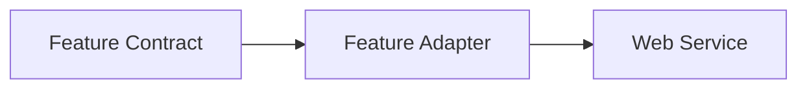
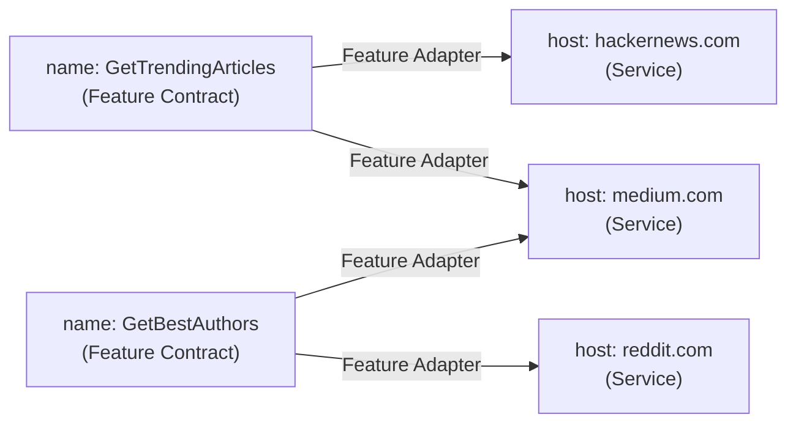

# web features

Exposing the web as generic features

# Concept

1. **Feature Contract**:

Defines the `input schema`, `output schema`, `context schema` and `test` for a given feature. [Read more](#feature-contract)

2. **Feature Adapter**:

Implements the contract for a service (by setting a **method** that takes an `input`+`context` and produces an `output`). [Read more](#feature-adapter)

3. **Service**:

A web service, defined by a `host` that can be interacted with using the feature adapter. [Read more](#service)

**Example**

# Genesis

The web exists to help the world openely share data and inter-connect. The only thing is that we don't all share how that should be happening and rightfully so.

We propose a minimalistic approach to abstract these into defined web features that can be used to connect to any web service in a generic way.

# Why

1. **Simplicity**

As a developer, web services can be hard to interact with. Leveraging the abstraction of the web features can help to simplify the way we interact with web services.

2. **Consistency**

Providing generic web features models can help to standardize the way we interact with web services. This can help to create a consistent way to interact with web services. While this will be opinionated, it will help to create a common ground for developers to interact with web services.

3. **Flexibility**

Steps to interact with a feature on web service can be complex and hard to describe accross languages or projects. By abstracting these into web features, we can handle the complexity as code in a more flexible way without restriction, only caring to get the correct output for a given input.

4. **Reusability**

Abstraction already happens in every project we build. By creating a common abstraction for web services, we may hope to build and maintain a community based set of web features that can be reused across projects.

# Definitions

## Feature Contract

| Property   | Format                       | Description               | Example                          |
| ---------- | ---------------------------- | ------------------------- | -------------------------------- |
| **name**   | pascal-cased name            | a unique descriptive name | `GetLastPosts`                   |
| **input**  | json schema compatible model | input schema              | `{ size: 10 }`                   |
| **output** | json schema compatible model | output schema             | `{ posts: post[] }`              |
| **ctx**    | json schema compatible model | additional context schema | `{ fetch:(Request) => Response}` |
| **test**   | async function               | test method               | -                                |

## Feature Adapter

| Property                  | Format                                | Description                                                |
| ------------------------- | ------------------------------------- | ---------------------------------------------------------- |
| [**host**](#host)         | valid host name                       | a unique host representing the service                     |
| [**contract**](#contract) | feature contract                      | ref to existing contract                                   |
| **handler**               | async ({ input, output, ctx}) => void | async method that builds the output given an input and ctx |
| **samples**               |                                       | list of input samples to run tests against                 |

## Service

| Property                         | Format                    | Description                            |
| -------------------------------- | ------------------------- | -------------------------------------- |
| **host**                         | valid host name           | a unique host representing the service |
| [**adapters**](#feature-adapter) | kv<name, feature adapter> | adapters bound to this service         |

## Development Guidelines

### Host

A host is a unique identifier that represents a web service. It should represent the main web service this web feature should be attached to by using the smallest domain level as the identifier.

Examples:

| Url                            | Host                   |
| ------------------------------ | ---------------------- |
| https://www.github.com         | github.com             |
| https://www.tiktok.com/@france | tiktok.com             |
| https://somebody.myshopify.com | somebody.myshopify.com |

### Schema properties

All schema properties should follow the `snake_case` formatting rule (lowercase with underscores).
This is to ensure that the schema properties are consistent and easy to read accross services/languages.

### Naming Features

Feature contracts should be named in `PascalCase` (capitalized with no spaces).
This is to simplify typing and accessing the feature contract in code (for any language).
